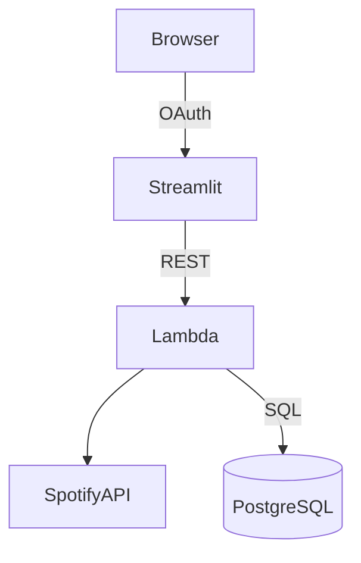

# Spotify Analytics Dashboard 🎧

A **Streamlit** web app and **AWS Lambda** backend that lets users log in with their Spotify account and explore deep insights into their listening habits—similar to *Spotify Wrapped* on demand.

## Features
- OAuth login via Spotify
- Interactive dashboards for:
  - Top artists, tracks, and genres
  - Listening habits by time of day and year
  - Obscurity ratings and trend analysis
- Serverless API layer on AWS Lambda + API Gateway
- Optional persistence to AWS RDS (PostgreSQL) for caching
- Deployable locally or to the cloud in minutes

## Architecture



## Quick start (local)

```bash
# 1. Create & activate a virtualenv
python -m venv env && source env/bin/activate

# 2. Install deps
pip install -r requirements.txt

# 3. Set environment variables
export SPOTIPY_CLIENT_ID=...
export SPOTIPY_CLIENT_SECRET=...
export SPOTIPY_REDIRECT_URI=http://localhost:8501/callback

# 4. Run the app
streamlit run app.py
```

## Deployment (AWS)

1. Package `lambda.py` with its dependencies using AWS SAM or Serverless Framework.
2. Add environment variables in Lambda configuration (see `.env.example`).
3. Point `API_URL` in `app.py` to the deployed Gateway endpoint.
4. (Optional) Provision an RDS PostgreSQL instance and set `DB_*` env vars.

## Testing

```bash
pip install pytest
pytest
```

## CI

A sample **GitHub Actions** workflow (`.github/workflows/ci.yml`) can run `flake8` + `pytest` on every push.

## Contributing

Pull requests are welcome! Please open an issue first to discuss changes.

## License

[MIT](LICENSE)
